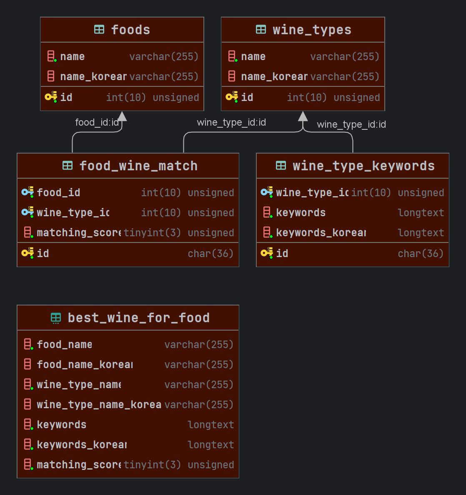

# Vinami🍷

A wine pairing service that helps you find the perfect wine to pair with your food.

## Translation

- [English](README.md)

## Table of Contents

- [Built With](#built-with)
- [Database ERD](#database-erd)
- [Authors](#authors)
- [License](#license)

## Built With

- [Spring Boot](https://spring.io/projects/spring-boot) - The web framework used
- [JPA](https://spring.io/projects/spring-data-jpa) - Database ORM
- [Gradle](https://gradle.org/) - Dependency Management
- [MariaDB](https://mariadb.org/) - Database

## Database ERD

## Authors

-   **Wan Sim** - _Initial work_

## License

This project is licensed under the [MIT License](LICENSE)
